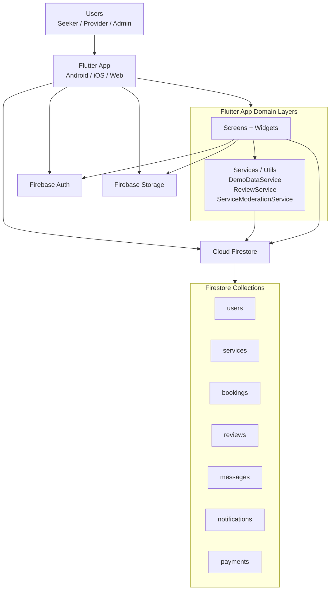

# System Architecture Diagram

## Overview

Lanka Connect is a Flutter client application that uses Firebase services directly.  
For Spark/free demo mode, business side-effects are executed in-app through Firestore transactions/writes.

## Diagram (Spark-Compatible Runtime)

## Key Runtime Responsibilities

- Authentication and role identity: Firebase Auth + `users/{uid}.role`.
- Data persistence and querying: Firestore collections.
- Profile images: Firebase Storage.
- Side effects (Spark mode, in-app):
  - Service post defaults to `pending`.
  - Admin approval writes moderation notification.
  - Review submission updates provider aggregate rating fields.
  - Admin demo data seeding performed in app code.
